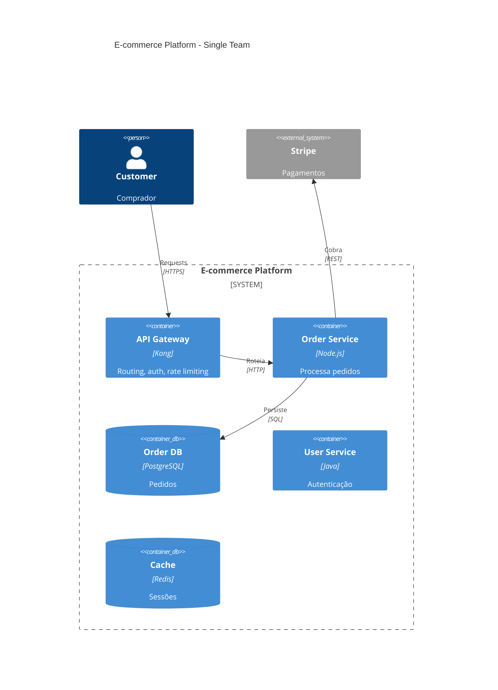
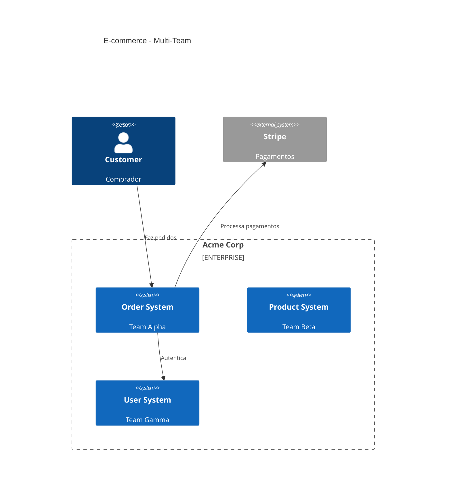
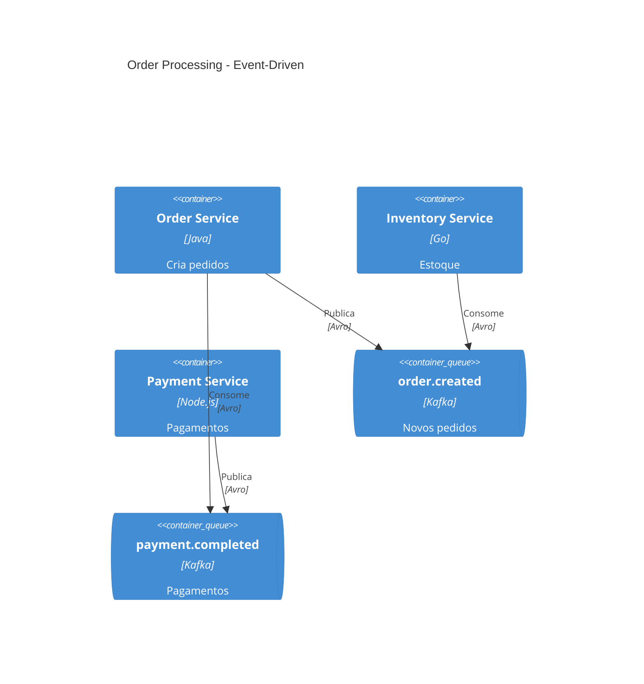
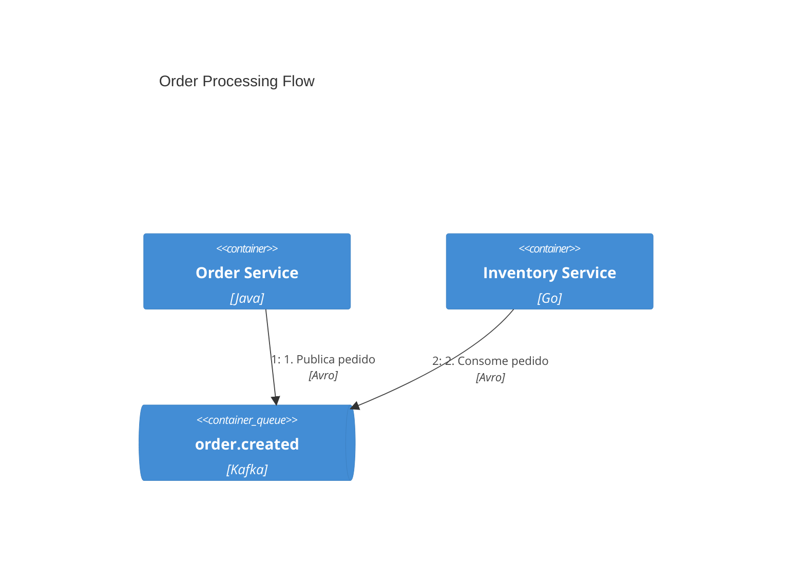
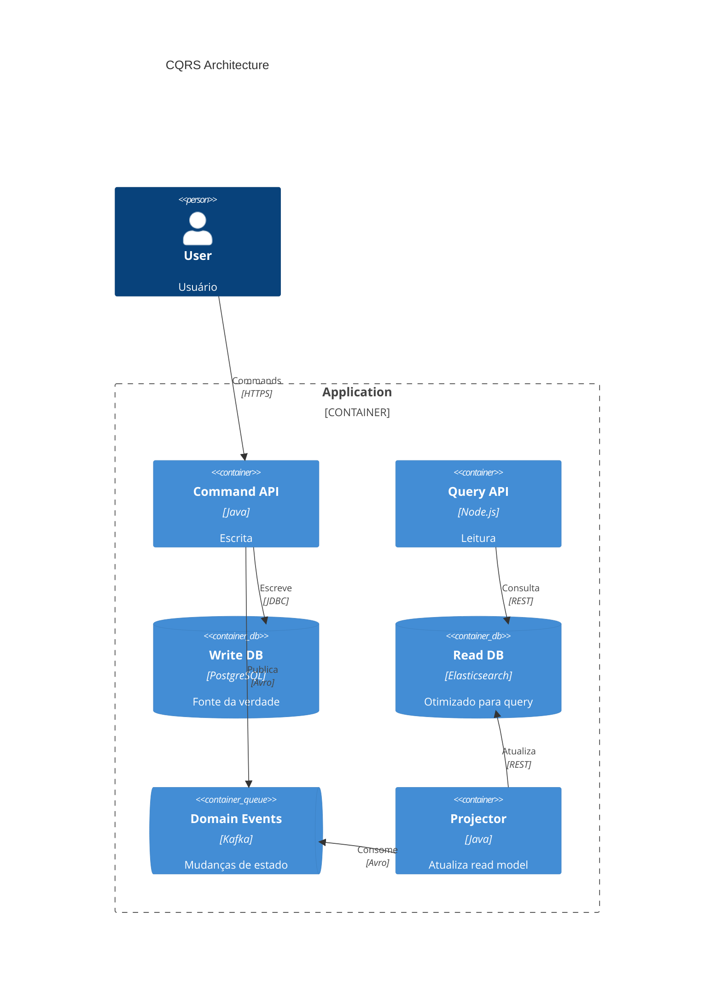
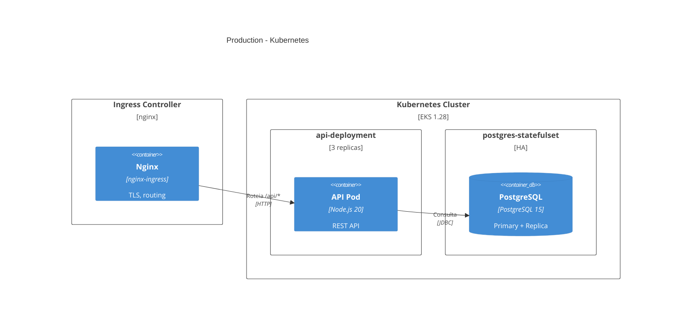

# C4 Advanced Patterns

Padrões para arquiteturas complexas: microservices, event-driven, deployment.
Adaptado de `softaworks/agent-toolkit`.

## Microservices

### Time único (containers)

Quando um time é dono de todos os serviços, modele cada um como `Container` dentro de um
`System_Boundary`:

### Múltiplos times (sistemas)

Quando times separados são donos de serviços distintos, **promova cada serviço a software system**
no Context, e cada time desenha seu próprio Container diagram:

## Event-driven

### Tópicos individuais

Modele cada tópico/fila como container separado para revelar os fluxos reais:

### Fluxo de eventos (Dynamic)

### CQRS

## Deployment

### Estrutura aninhada

Use `Deployment_Node` aninhados para representar a hierarquia real (cloud > VPC > subnet > cluster),
com containers nas folhas:

Padrões comuns: VPC com subnets públicas/privadas (ALB → ECS → RDS/ElastiCache), Kubernetes
(ingress → deployments → statefulsets) e multi-região active-active (global LB → regiões com
réplicas e bancos).
