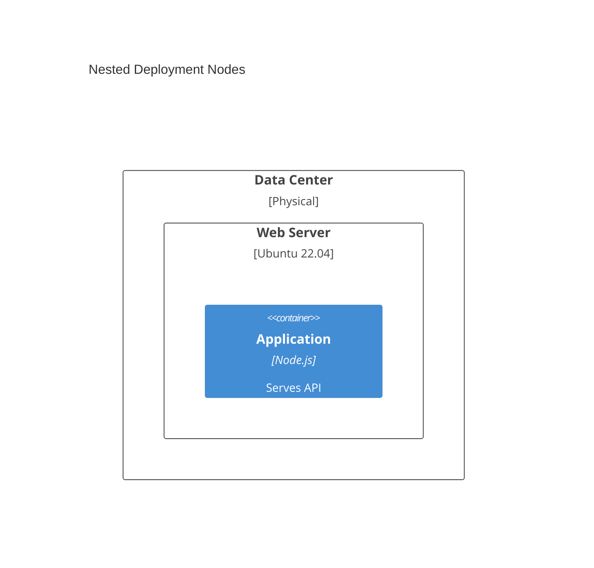
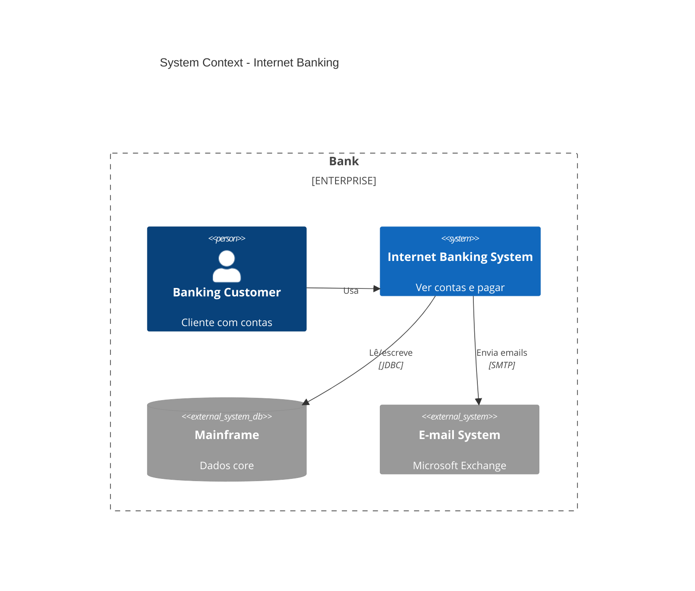
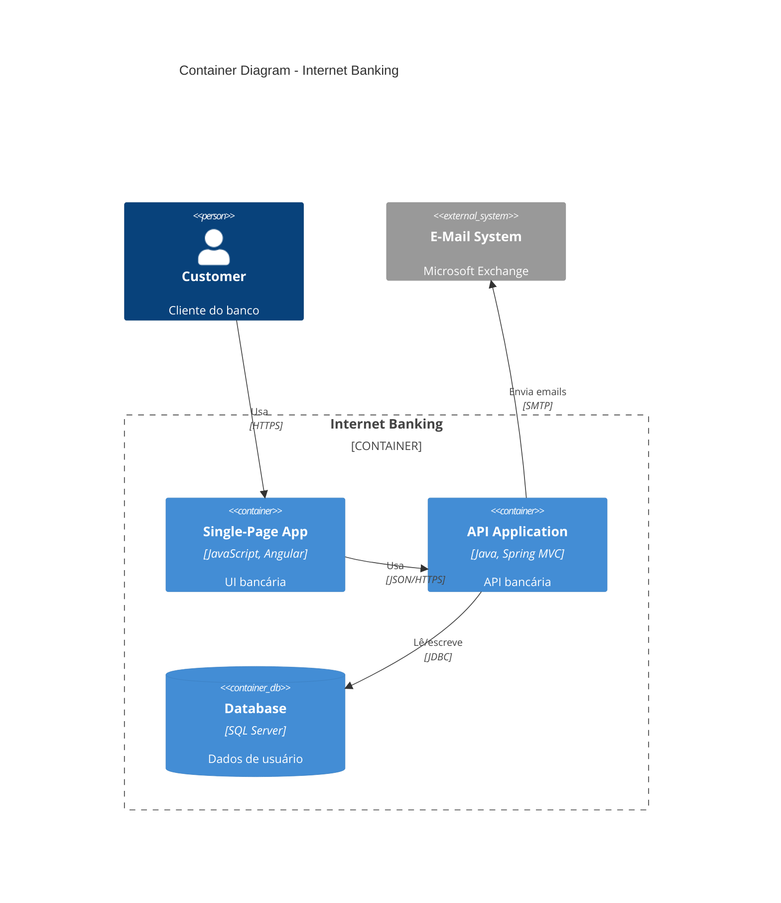
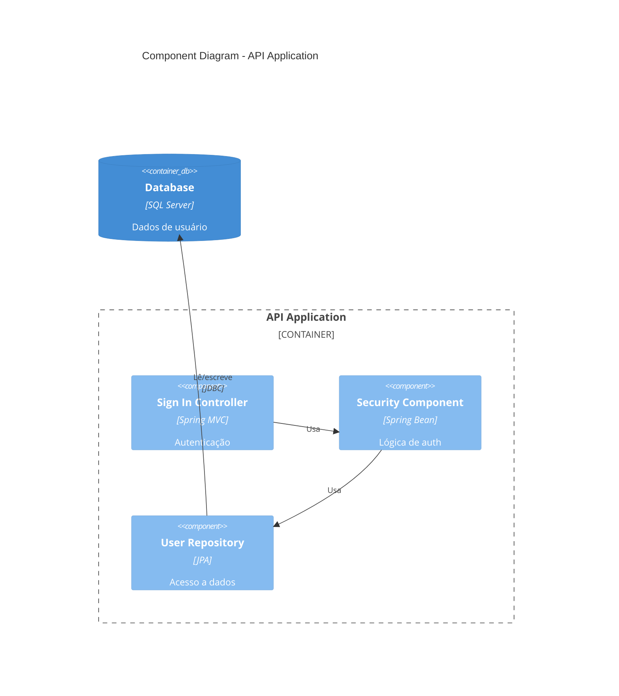
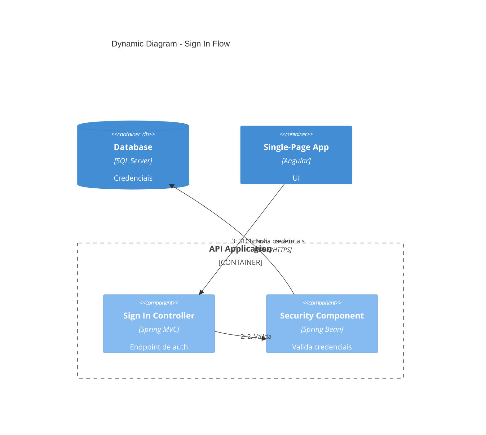
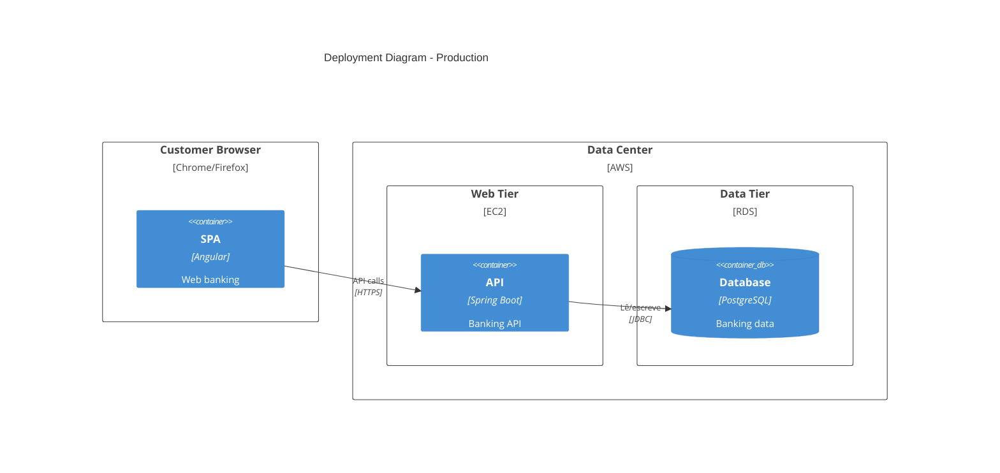

# C4 Mermaid Syntax Reference

Referência de sintaxe para diagramas C4 em Mermaid (compatível com a sintaxe C4 do PlantUML).
Adaptado de `softaworks/agent-toolkit`.

## Tipos de diagrama

Cada diagrama começa com a declaração de tipo:

| Tipo | Declaração | Mostra |
|---|---|---|
| System Context | `C4Context` | Sistema no contexto de usuários e sistemas externos |
| Container | `C4Container` | Blocos técnicos de alto nível |
| Component | `C4Component` | Componentes internos de um container |
| Dynamic | `C4Dynamic` | Fluxos de request com sequência numerada |
| Deployment | `C4Deployment` | Infraestrutura e nós de deploy |

## Elementos por nível

### Pessoas e sistemas (Context)

```
Person(alias, "Label", "Descrição")
Person_Ext(alias, "Label", "Descrição")        # pessoa externa
System(alias, "Label", "Descrição")
System_Ext(alias, "Label", "Descrição")        # sistema externo
SystemDb(alias, "Label", "Descrição")           # sistema de banco
SystemQueue(alias, "Label", "Descrição")        # sistema de fila
```

### Containers

```
Container(alias, "Label", "Tecnologia", "Descrição")
Container_Ext(alias, "Label", "Tecnologia", "Descrição")
ContainerDb(alias, "Label", "Tecnologia", "Descrição")
ContainerQueue(alias, "Label", "Tecnologia", "Descrição")
```

### Components

```
Component(alias, "Label", "Tecnologia", "Descrição")
Component_Ext(alias, "Label", "Tecnologia", "Descrição")
ComponentDb(alias, "Label", "Tecnologia", "Descrição")
ComponentQueue(alias, "Label", "Tecnologia", "Descrição")
```

### Deployment nodes (aninháveis)

```
Deployment_Node(alias, "Label", "Tipo", "Descrição") { ... }
Node(alias, "Label", "Tipo", "Descrição") { ... }   # atalho
```



## Boundaries

```
Enterprise_Boundary(alias, "Label") { ... }   # sistemas e pessoas
System_Boundary(alias, "Label") { ... }        # containers
Container_Boundary(alias, "Label") { ... }     # components
Boundary(alias, "Label", "tipo") { ... }       # genérico
```

## Relacionamentos

```
Rel(from, to, "Label")
Rel(from, to, "Label", "Tecnologia")
BiRel(from, to, "Label")                  # bidirecional (evitar)
Rel_U / Rel_D / Rel_L / Rel_R(from, to, "Label")   # dicas de direção
```

Em diagramas Dynamic, a sequência é determinada pela ordem das declarações; numere no rótulo
(`"1. Submit"`, `"2. Validate"`).

## Estilo e layout

```
UpdateLayoutConfig($c4ShapeInRow="3", $c4BoundaryInRow="1")
UpdateElementStyle(alias, $bgColor="grey", $fontColor="red", $borderColor="red")
UpdateRelStyle(from, to, $textColor="blue", $lineColor="blue", $offsetX="5", $offsetY="-10")
```

- `$c4ShapeInRow` (default 4) e `$c4BoundaryInRow` (default 2) reduzem aglomeração.
- `$offsetX` / `$offsetY` corrigem rótulos de relação sobrepostos.

## Exemplos completos

### Context



### Container



### Component



### Dynamic



### Deployment



## Limitações do Mermaid

- O índice de `RelIndex` é ignorado; a ordem das linhas define a sequência em Dynamic.
- Layouts densos exigem `UpdateLayoutConfig` e divisão em múltiplos diagramas.
