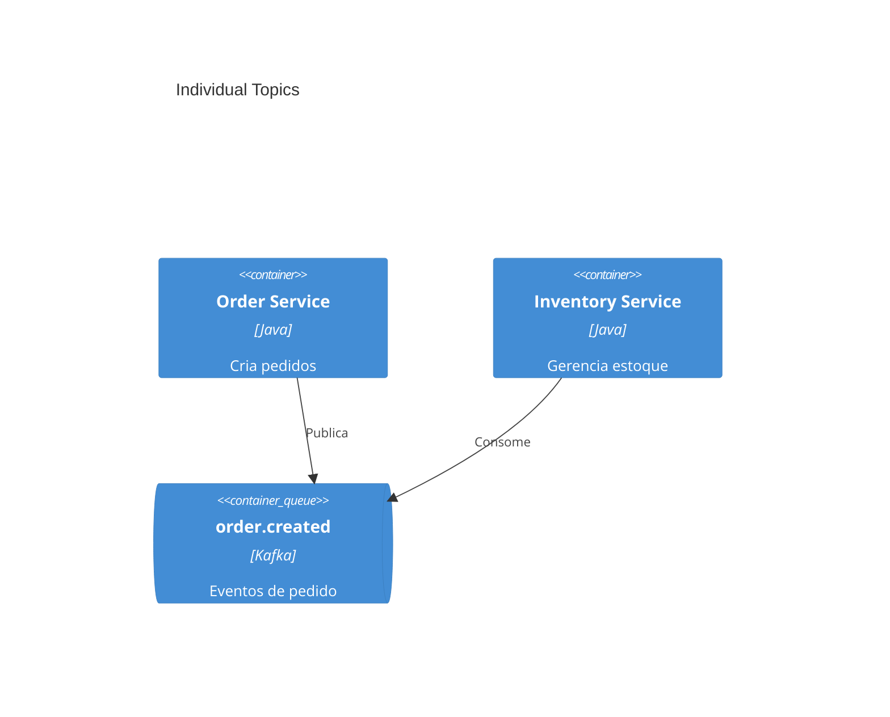
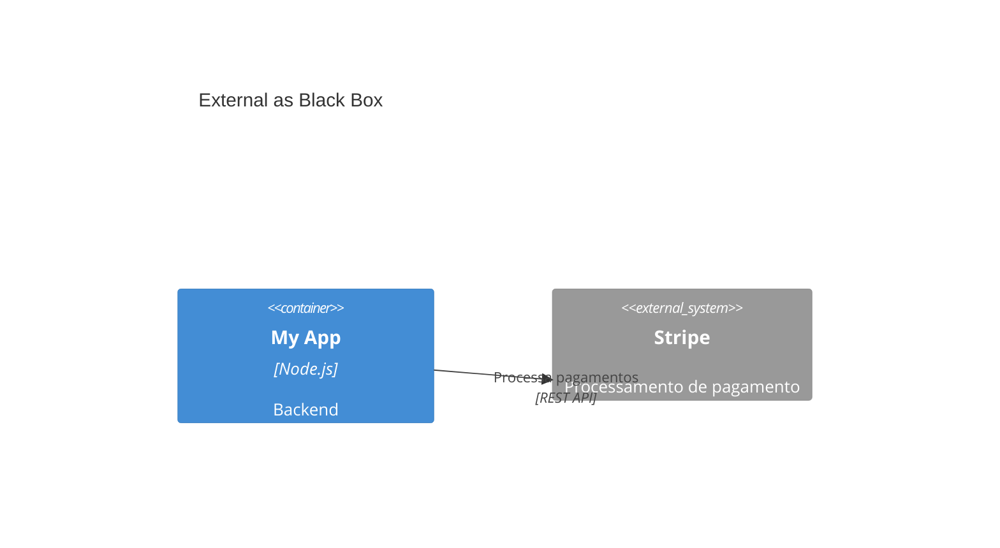

# C4 Common Mistakes

Anti-patterns frequentes ao criar diagramas C4 e o que fazer no lugar.
Adaptado de `softaworks/agent-toolkit`.

## Nível de abstração

### Confundir Container com Component

- **Container**: unidade deployável (aplicação, serviço, banco).
- **Component**: elemento interno não deployável (módulo, classe, pacote).

Errado: mostrar classes Java como `Container`. Certo: classes como `Component` dentro de um
`Container_Boundary`.

### Inventar níveis não definidos

C4 tem níveis fixos (Person, Software System, Container, Component). Não crie "subcomponents",
"módulos" ou "microservice groups" como níveis. Se precisar de mais detalhe, é nível Code (UML) —
que **este harness não mantém**.

### Subsistemas vagos

`Subsystem(...)` é ambíguo. Seja específico: `System`, `Container` ou `Component`.

## Bibliotecas compartilhadas

Modelar uma lib compartilhada como `Container` implica que ela roda como serviço independente —
falso. Bibliotecas são copiadas para dentro das aplicações. Mostre-a como `Component` dentro de cada
serviço, ou simplesmente omita (é detalhe de implementação).

## Message brokers

Mostrar Kafka/RabbitMQ como um único container cria um diagrama "hub and spoke" que esconde os
fluxos reais. Modele **tópicos/filas individuais** como containers:

Alternativa: colocar o tópico no rótulo da relação (`Rel(a, b, "order.created", "Kafka")`).

## Sistemas externos

Você não controla sistemas externos; mostrar internals deles cria acoplamento e fica obsoleto.
Trate-os como caixa-preta com `System_Ext`:

## Metadados e rótulos

- **Sempre inclua tipo** (`Container`, `Component`, `System`) — não use caixas genéricas.
- **Sempre inclua descrição** — elementos sem descrição forçam adivinhação.
- **Rótulos de relação com verbo e dados** — "Busca produtos, envia pedidos" + tecnologia, não "usa".

## Escopo e audiência

| Audiência | Níveis apropriados |
|---|---|
| Executivos | Context (L1) |
| Product Managers | Context + Container |
| Arquitetos | Context + Container + Components-chave |
| Desenvolvedores | Todos conforme necessário |
| DevOps | Container + Deployment |

- **Não crie todos os níveis por padrão.** Sempre crie Context e Container; crie Component só se
  agregar valor; Code raramente (deixe o IDE gerar).
- **Não passe de ~20 elementos por diagrama.** "Se um diagrama com uma dúzia de caixas é difícil de
  entender, não desenhe uma dúzia de caixas." Divida por bounded context.

## Setas

- **Evite bidirecionais** (`BiRel`): ambíguo quem inicia. Use duas setas direcionais ou a
  perspectiva do iniciador.
- **Nunca deixe setas sem rótulo.** Diga o que flui e a tecnologia.

## Deployment

Não coloque detalhes de infraestrutura (réplicas, load balancer, instâncias) no diagrama de
Container. Container mostra arquitetura lógica; infraestrutura vai no `C4Deployment`.
